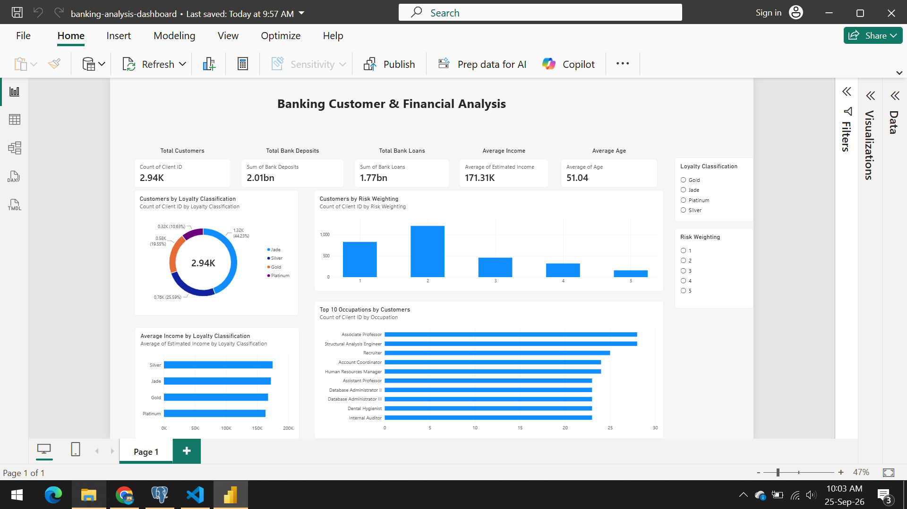

# Banking Customer & Financial Analysis

## 📌 Project Overview

This is an end-to-end Data Analytics project focused on analyzing banking customer, financial, and risk-related data.

The project covers the complete analytics workflow, including data quality checks, data cleaning, SQL analysis, exploratory data analysis, and interactive dashboard development.

The analysis was performed using Python, PostgreSQL, and Power BI.

---

## 📊 Dashboard Preview



---

## 🎯 Business Problem

Banks collect large amounts of customer and financial data. Analyzing this information can help understand customer segments, financial activity, and risk patterns.

The objective of this project is to analyze banking customer data and generate meaningful insights that can support business understanding and decision-making.

---

## 🎯 Project Objectives

- Analyze the bank's customer base
- Understand customer loyalty classifications
- Analyze customer income and financial holdings
- Examine bank deposits and loans
- Analyze customer risk weighting
- Identify top customer segments
- Create an interactive Power BI dashboard

---

## 🛠️ Tools & Technologies

- **Python** – Data cleaning and Exploratory Data Analysis
- **Pandas** – Data manipulation
- **Matplotlib** – Data visualization
- **PostgreSQL** – SQL analysis
- **Power BI** – Interactive dashboard
- **GitHub** – Project documentation and version control

---

## 📊 Dataset

The dataset contains approximately **3,000 banking customer records** and **25 columns** covering customer demographics, financial information, banking products, loyalty classification, and risk weighting.

### Key data fields

- Client ID
- Age
- Location
- Joined Bank
- Nationality
- Occupation
- Loyalty Classification
- Estimated Income
- Credit Card Balance
- Bank Loans
- Bank Deposits
- Checking Accounts
- Saving Accounts
- Foreign Currency Account
- Business Lending
- Properties Owned
- Risk Weighting

---

## 🔍 Data Quality & Cleaning

The dataset was first inspected using Python.

The following checks were performed:

- Dataset dimensions
- Data types
- Missing values
- Duplicate records
- Numerical value validation
- Categorical value validation

### Data quality results

- 3,000 records
- 25 columns
- No duplicate rows
- No missing values
- `Joined Bank` converted to a proper date format
- Numerical values checked for obvious invalid values

---

## 🗄️ SQL Analysis

PostgreSQL was used to perform business-oriented analysis.

Key questions included:

1. How many unique customers are there?
2. How are customers distributed across loyalty classifications?
3. What is the average customer age?
4. What are the top occupations by customer count?
5. What is the average estimated income?
6. What are the total bank deposits?
7. What are the total bank loans?
8. What is the average credit-card balance?
9. What is the average savings account balance?
10. How many customers have credit cards?
11. How many customers have business lending?
12. What is the average number of properties owned?
13. How are customers distributed by risk weighting?
14. What is the average income across risk categories?
15. Which customers have the highest combined financial holdings?

---

## 🐍 Python EDA

Python and Pandas were used to explore:

- Customer age distribution
- Income distribution
- Loyalty classification
- Risk weighting
- Financial metrics by customer segment
- Relationships between income, deposits, loans, and savings

Matplotlib was used to create supporting visualizations.

---

## 📈 Power BI Dashboard

The Power BI dashboard provides an interactive overview of the banking customer data.

### Dashboard includes

- Total Customers
- Total Bank Deposits
- Total Bank Loans
- Average Income
- Average Customer Age
- Customers by Loyalty Classification
- Customers by Risk Weighting
- Average Income by Loyalty Classification
- Top 10 Occupations by Customers

### Interactive Filters

- Loyalty Classification
- Risk Weighting

---

## 💡 Key Insights

- The dataset contains **2,940 unique customers** across 3,000 records.
- **Jade** is the largest loyalty classification with 1,319 customers.
- The average customer age is **51.04 years**.
- Total bank deposits are approximately **2.01 billion**.
- Total bank loans are approximately **1.77 billion**.
- Risk weighting level **2** contains the largest customer group.
- In this dataset, higher risk-weighting categories are associated with higher average estimated income.

---

## 📁 Project Structure

```text
Banking-Data-Analysis/
│
├── data/
│   ├── Banking.csv
│   └── Banking_cleaned.csv
│
├── python/
│   └── banking_analysis.ipynb
|
├── screenshots/
│   └── dashboard.png
|
├── sql/
│   └── analysis.sql
│
├── powerbi/
│   └── banking-analysis-dashboard.pbix
│
└── README.md
```

## 🚀 Project Workflow

``` text
Raw Dataset
     ↓
Data Quality Check
     ↓
Data Cleaning
     ↓
PostgreSQL Analysis
     ↓
Python EDA
     ↓
Power BI Dashboard
     ↓
Business Insights
```

# 👨‍💻 Author
## Anirudh Bantaram
### Skills: Python | SQL | PostgreSQL | Power BI | Excel | Data Analysis
